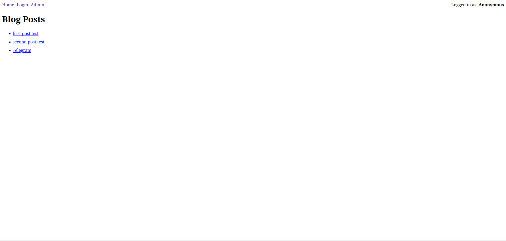
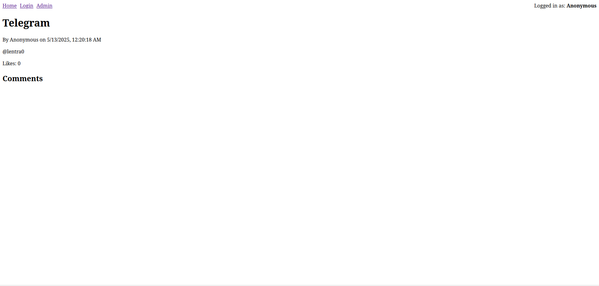
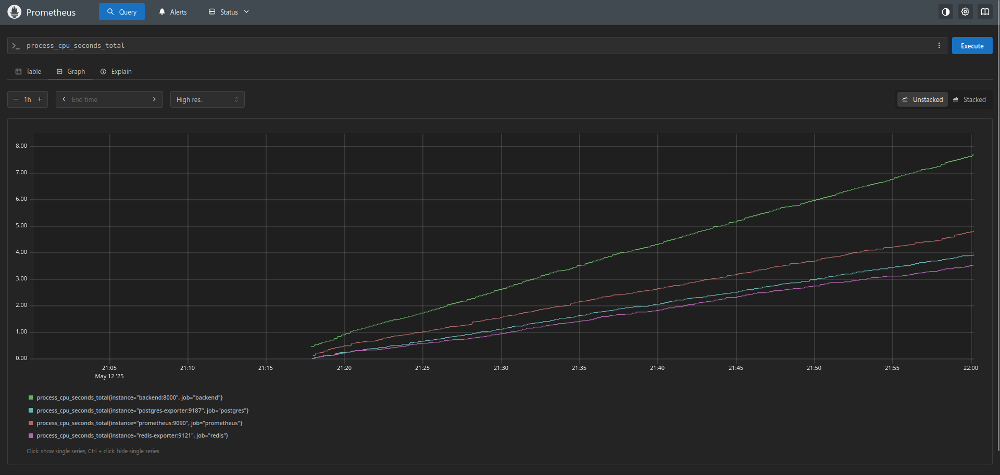
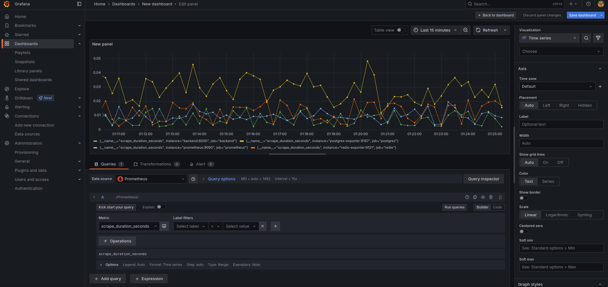

# Containerized Blog Platform

<p align="center">
  <a href="#">
    
  </a>
  <a href="#">
    
  </a>
  <a href="#">
    
  </a>
  <a href="#">
    
  </a>
  <a href="#">
    
  </a>
  <a href="#">
    
  </a>
  <a href="#">
    
  </a>
</p>

---

## Table of Contents

- [Project Overview](#project-overview)
- [Tech Stack](#tech-stack)
- [Repo Structure](#repo-structure)
- [Features](#features)
- [Local Development](#local-development)
- [Kubernetes Deployment](#kubernetes-deployment)
- [CI/CD Pipeline](#ci-cd-pipeline)
- [Database Backups](#database-backups)
- [Authentication](#authentication)
- [Screenshots](#screenshots)
- [Monitoring](#monitoring)

---

## Project Overview

A full-stack **Containerized Blog Platform** showcasing:

- **Frontend**: Next.js (TypeScript)
- **Backend**: FastAPI (Python)
- **Database**: PostgreSQL + Redis
- **Containerization**: Docker & Docker Compose
- **Local Kubernetes**: Minikube/Kind manifests
- **CI/CD**: GitHub Actions
- **Monitoring**: Prometheus + Grafana
- **Database Backups**: pg_dump script
- **Authentication**: JWT-based user registration & login

---

## Tech Stack

<p align="center">
  
  
  
  
  
  
  
</p>

---

## Repo Structure

```
.
├── backend
│   ├── Dockerfile
│   ├── requirements.txt
│   └── app
│       ├── main.py         # FastAPI entrypoint
│       ├── config.py       # Environment and settings
│       ├── models          # SQLAlchemy models
│       ├── schemas         # Pydantic schemas
│       ├── crud            # CRUD helpers
│       ├── routers         # API endpoints
│       └── scripts         # Backup scripts
├── frontend                # Next.js application
│   ├── Dockerfile          
│   ├── pages               # React pages
│   └── components          # Reusable components
├── kubernetes              # K8s manifests
├── docker-compose.yml      # Local orchestration
├── .github/workflows       # CI pipeline
├── docs/images             # Documentation and screenshots
└── README.md               # Project docs
```

---

## Features

- User registration & JWT authentication
- CRUD posts (create, read, delete), comments, likes
- Admin panel to create new posts
- Real-time caching via Redis
- Automatic DB migrations & schema creation
- Local development with Docker Compose
- Kubernetes manifests for production-like environment
- Continuous integration & testing
- DB backup script (pg_dump; optional S3 upload)

---

## Local Development

**Prerequisites**: Docker & docker-compose

1. Start all services:
   ```bash
   docker-compose up --build -d
   ```
  Copy `.env.example` to `.env` and populate it before running.
2. **Frontend**: open http://localhost:3000
3. **Register** a new user: switch to Register mode, provide a username and password, and submit the form.
4. **Login**: switch to Login mode, provide credentials, and submit the form. A success message is displayed on successful authentication.
5. **Admin Panel**: open http://localhost:3000/admin and create new posts.
6. **Browse Posts**: view all posts on the main page.

*If API calls fail, verify the backend is running at http://localhost:8000 (`docker-compose ps`) and retry.*

---

## Kubernetes Deployment

1. Enable ingress:
   ```bash
   minikube addons enable ingress
   ```
2. Apply manifests:
   ```bash
   kubectl apply -f kubernetes/
   ```
  The `kubernetes/` folder contains templates for `Secrets`, `ConfigMaps`, and a `PersistentVolumeClaim` for Postgres.
3. Access services via `minikube ip`:
   - Frontend: `http://<minikube_ip>`
   - API: `http://<minikube_ip>/api`

---

## CI/CD Pipeline

On pushes to `main`, GitHub Actions will:

- Spin up PostgreSQL & Redis
- Install & test backend (pytest)
- Build & test frontend
- Build Docker images

---

## Database Backups

Run the backup script (saves a local copy):

```bash
bash backend/app/scripts/backup.sh
```

Backups are stored locally in `backups/` by default. Optional: to upload backups to S3 or an S3-compatible storage, set `AWS_BUCKET` and AWS credentials in `.env` (the upload step is skipped when `AWS_BUCKET` is not set).

---

## Authentication

This platform uses JSON Web Tokens (JWT) for user authentication:

- **Register**: `POST /api/auth/register` with `{ "username": "<username>", "password": "<password>" }` to create a user.
- **Login**: `POST /api/auth/login` (form data `username`, `password`) to obtain `{ access_token, token_type }`.
- **Get Current User**: `GET /api/auth/me` with `Authorization: Bearer <token>` to retrieve user info.

Frontend:
- The `/login` page provides forms to register and log in; on login, the JWT token is stored in `localStorage` and added to Axios headers.
- Protected actions (creating posts, comments, likes) require the JWT in the `Authorization` header.

## Posts API

- **List Posts**: `GET /api/posts` returns all posts.
- **Get Post**: `GET /api/posts/{post_id}` returns a single post.
- **Create Post**: `POST /api/posts` with JSON `{ title, content }`, requires JWT.
- **Delete Post**: `DELETE /api/posts/{post_id}`; no authentication required; returns `204 No Content`.

Security note: The Delete Post endpoint currently allows unauthenticated deletes. This is unsafe — consider requiring authorization/ownership checks. See `backend/routers/posts.py` to fix.

---

## Screenshots

### Home Page
<p align="center">
  
</p>

### Single Post View
<p align="center">
  
</p>

### Prometheus UI
<p align="center">
  
</p>

### Grafana UI
<p align="center">
  
</p>

---

## Monitoring

- **Prometheus**: http://localhost:9090 — metrics and alerting UI
- **Grafana**: http://localhost:3001 — dashboards (default login: `admin` / `admin`)
- **Backend metrics**: http://localhost:8000/metrics
- **Redis exporter**: http://localhost:9121/metrics
- **Postgres exporter**: http://localhost:9187/metrics

---

*Author: @lentra0*
